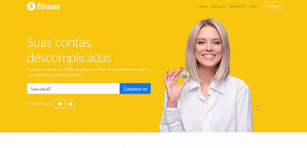

## 💻 Sobre

:speech_balloon: Repositório contendo projetos simples de Frontend e desenvolvimento web. 

 

## 🎨 Layout

  

 

## 💜 Agradecimentos

Obrigado aos instrutures Jorge Sant Ana e Jamilton Damasceno, responsáveis pelo curso [Desenvolvimento Web Completo 2021](https://www.udemy.com/course/web-completo/) por disponibilizar esse conteúdo sensacional 🚀.