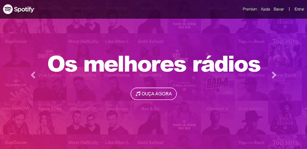

## 💻 Sobre

:speech_balloon: Landing page do site do Spotify. 

 

## 🎨 Layout

  

 

## 🛠 Tecnologias

As seguintes ferramentas foram usadas na construção do projeto:

- [Bootstrap](https://getbootstrap.com/)
- [HTML](https://developer.mozilla.org/pt-BR/docs/Web/HTML)
- [CSS](https://developer.mozilla.org/pt-BR/docs/Web/CSS)

 

## 💜 Agradecimentos

Obrigado aos instrutores Jorge Sant Ana e Jamilton Damasceno, responsáveis pelo curso [Desenvolvimento Web Completo 2021](https://www.udemy.com/course/web-completo/) por disponibilizar esse conteúdo sensacional 🚀.